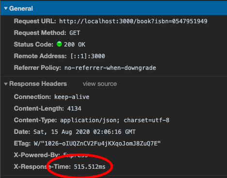
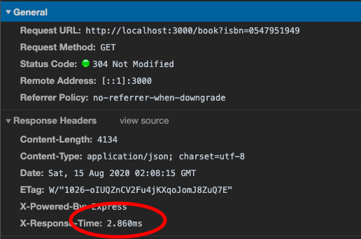

# CACHING REDIS
## Simple caching service with Redis

A practical and simple example to demonstrate the use of cache in API response to speed up data access and reduce the number of calls to your external services.

## NO CACHE

## CACHE

## USAGE
docker-compose up 

Search by a ISBN book valid on your [Localhost](http://localhost:3000/book?isbn=9788532503237)